Recycling Production line Manager selection system.

The end to end candidate evaluation and ranking system will be created to serve the purposes of helping to find the most suitable Recycling Production Line Managers by applying structured AI-like exams and a clear visual dashboard.

🌟 Overview

It is not an easy task to hire a production line manager. Considering the role, it requires an individual that is able to manage crises, knowledgeable on sustainability practices, and a team leader.
This system eases that process judging 40 candidates on three essential dimensions and ranking them automatically.

The candidates will be rated on a 1-10 scale in:

Crisis Management

Sustainability Knowledge

Team Motivation & Leadership

The overall score (of 30) is used to achieve the final ranking which is presented in a user-friendly dashboard.

✨ Key Features

Top 10 Leaderboard
See the best candidates immediately, and particularly the best performers.
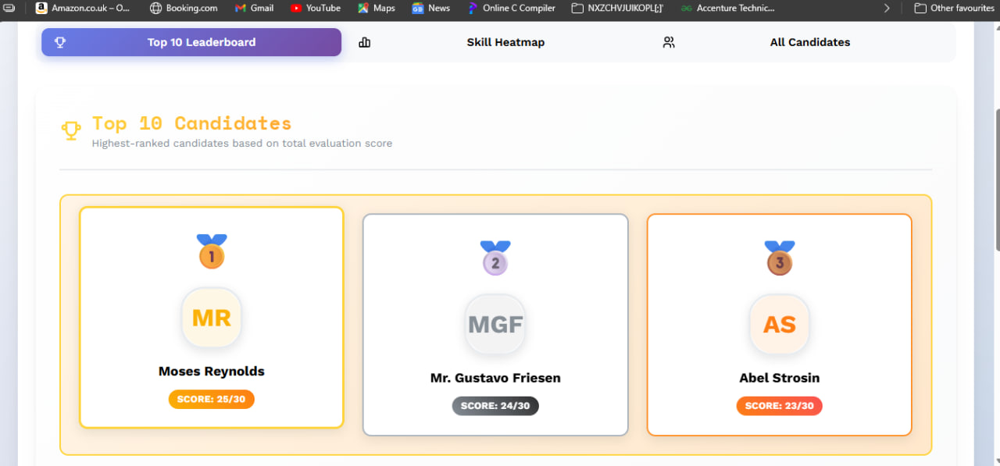

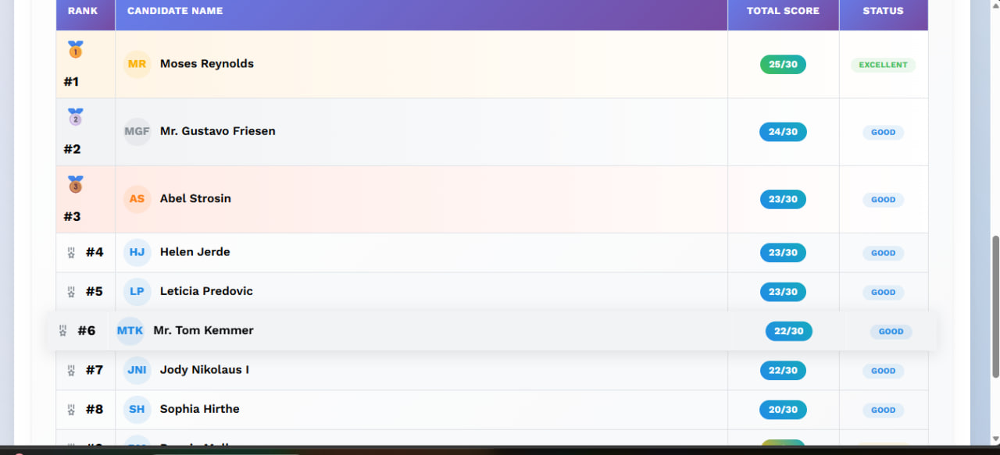

Candidate Profile Cards
Store important information, such as experience, skills and evaluation scores, in a single location.

Heatmap A visualization of skills (Heatmap-style).
The performance in all three measures of evaluation is visually represented in the form of progress bars.
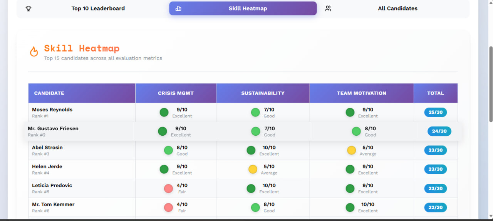
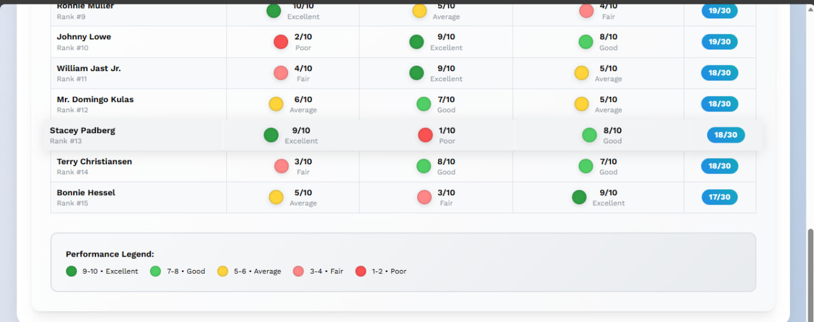

Auto-Ranking System
The system has automatic MySQL triggers and does not require manual recalculation.
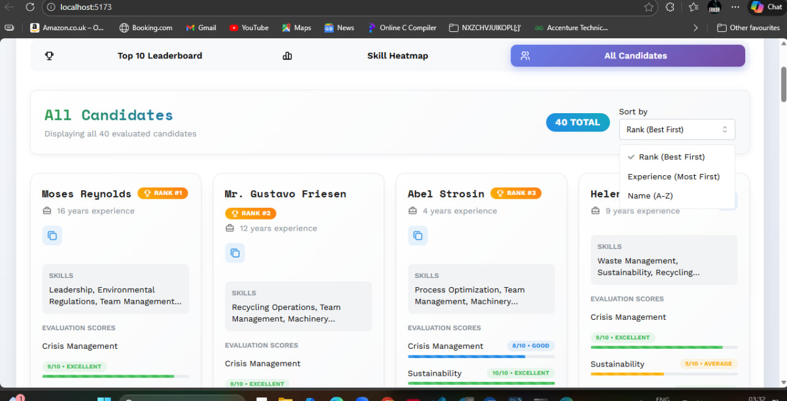
Realistic Test Data
Faker.js is a fake profile generator of candidate profiles used in meaningful testing.
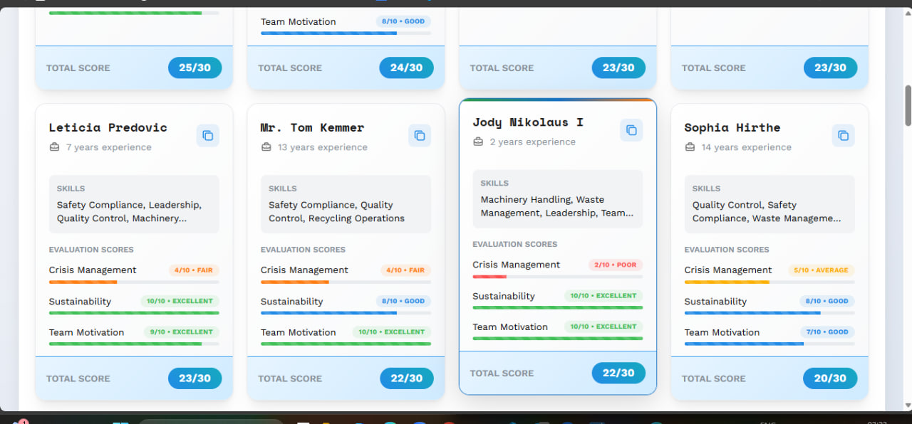

Responsive Dashboard
Browses well on tablet, desktop and mobile screens.

Bonus Share Candidate Profiles.
The details of the candidates can be copied and shared with the team members easily.

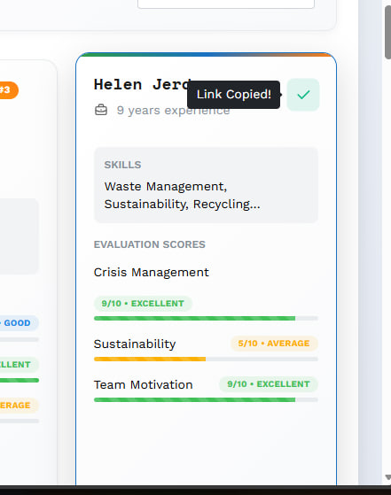

🛠️ Technology Stack

Frontend

React (with Vite)

Its components are modern and clean, known as mantique UI.

Backend

Node.js

Express.js (REST API)

Database

MySQL 8.0

Conditions to automatic ranking.

Data Generation

Faker.Js to use in realistic candidate profiles.

🚀 Getting Started
Prerequisites

Node.js 18+

MySQL 8+

npm

A few minutes ☕

1️⃣ Clone the Repository
git clone <|human|>git clone [github.com/YOUR_USERNAME/recycling-manager-selection](https://github.com/Mayank3847/recycling-manager-selection.git)
cd recycling-manager-selection

2️⃣ Database Setup
mysql -u root -p

Create database recycling manager-db;
USE recycling_manager_db;
SOURCE backend/db/schema.sql;
EXIT;
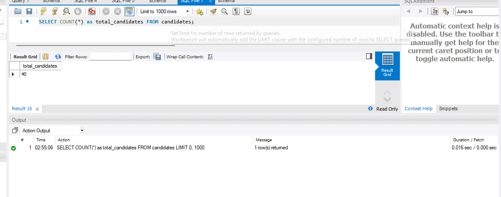
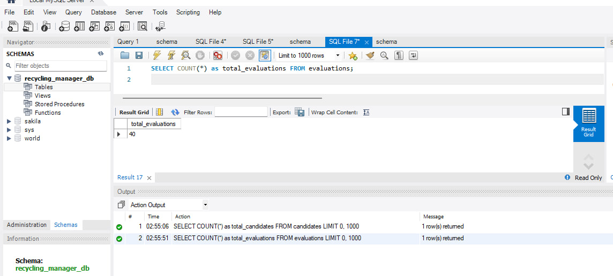
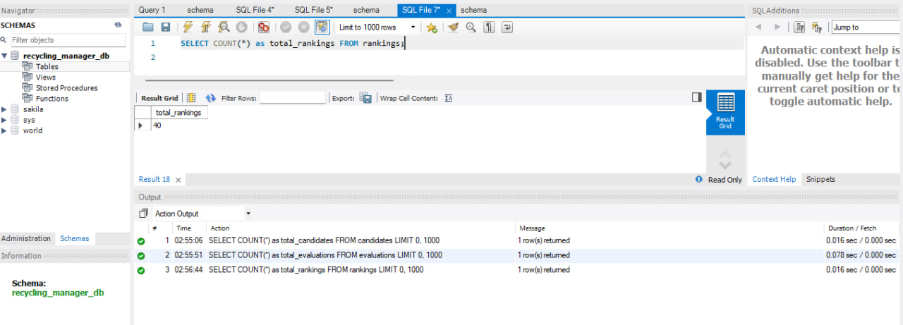

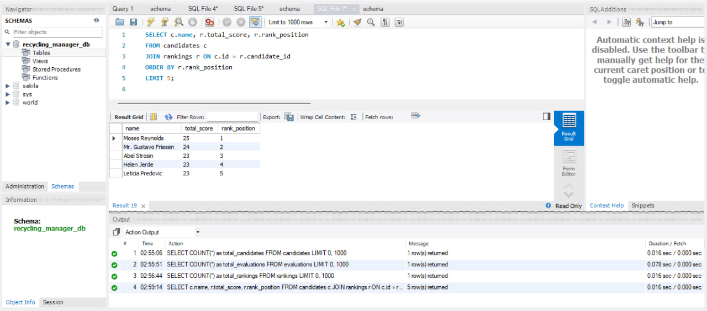
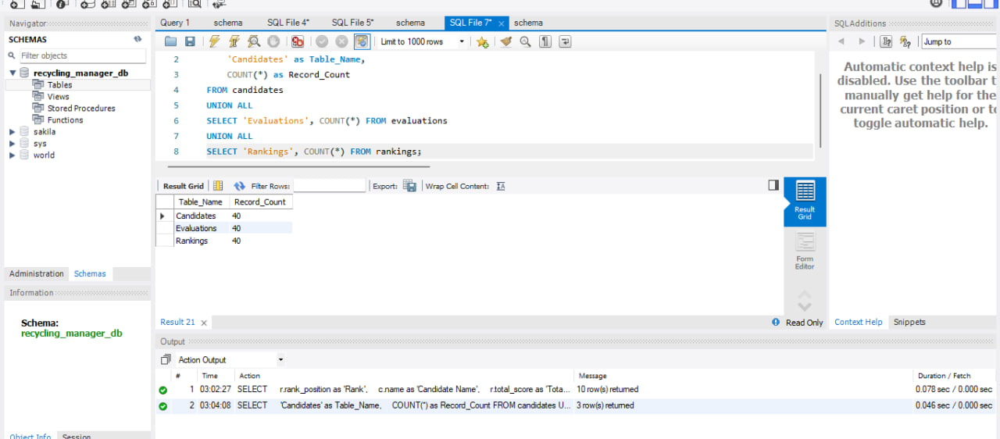

3️⃣ Generate Candidates
cd backend/db
npm install

You will need to update your MySQL password in generator.js; run:

node generator.js

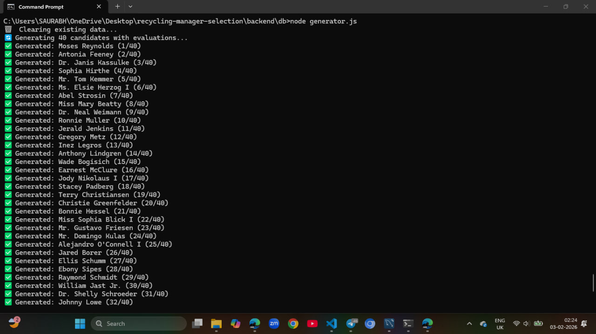
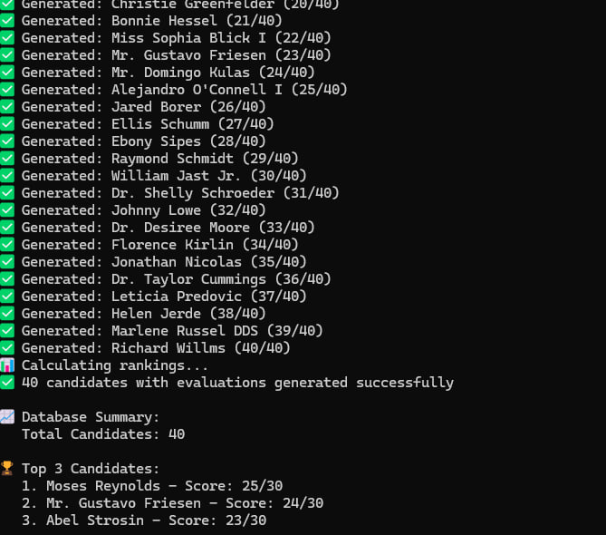
Expected output:

✅ 40 reviewed candidates that were successful generated.

4️⃣ Start the Backend
cd backend
npm install
node server.js
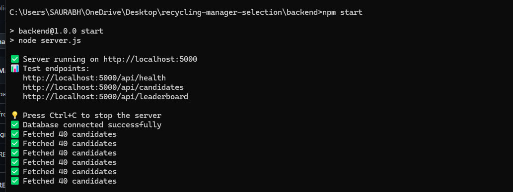

Result:

✅ Server on http://localhost:5000.

Keep this terminal open.

5️⃣ Start the Frontend

Open a new terminal:

cd frontend
npm install
npm run dev

Open:

http://localhost:5173

You are now connected to your dashboard.

🎯 How to Use the System

Leaderboard: Rapidly recognise the best candidates.

Candidate Cards: See all the information about experience, skills and performance.

Skill Scores: Skills Strengths and weaknesses will be displayed in real time as a progress bar.

Sharing: Share candidate information with your colleagues.

🤖 Evaluation Logic

All the candidates are evaluated on:

Crisis Management (1–10)

Emergency handling

Safety prioritization

Making decisions under stress.

Sustainability Knowledge (1–10)

Recycling processes

Environmental compliance

Resource efficiency

Team Motivation (1–10)

Leadership skills

Conflict resolution

Team engagement

The results are automatically added together and rankings are always updated through an automatic database update.

💾 Database Design

Three interlinked tables are used in the database:

candidates- Personal and professional information.

assessments - AI-based metrics of every measure.

rankings The total score and rank are auto-calculated.

Rankings are maintained with the help of a MySQL trigger each time evaluations were entered.

🔌 API Endpoints

GET /api/candidates -All the candidates whose scores and rankings are available.

GET /api/leaderboard -Only first 10 candidates.

GET /api/health - health check of the server.

🧪 Testing

Database Check

SELECT Count (*) of the candidates;  --Should be 40.

API Test

http://localhost:5000/api/candidates

Dashboard

http://localhost:5173

🐛 Common Issues & Fixes

Connection error:localhost is unreachable through a web browser browser.

Access denied: Wrong mysql password→ edit config files.

Blank dashboard: Renew the data generator one more time

Busy Port 5000: terminate processes of existing nodes.

📁 Project Structure
recycling-manager-selection/
├── backend/
│   ├── db/        # schema & data generator
│   ├── ai/        # AI prompts
│   └── server.js  # API server
├── frontend/      # React dashboard
|human|>|human|>|human|>|human|>|human|>/ screenshots/
└── README.md

🎨 Design Choices

Mock API scores are economical and ensure that testing is not complex.

Database triggers provide consistency of data.

Decision-making is better enhanced by visual scoring.

Layout will be responsive and all devices will be usable.

📸 Screenshots

The screenshots can be evaluated by using all the screenshots in the /screenshots folder.

👤 Author

Mayank Shekhar
GitHub: https://github.com/Mayank3847
Gmail : mayankshekhar0303@gmail.com
LinkedIn : https://www.linkedin.com/in/mayank-shekhar-44a81328a/
Contact : 7295059168

